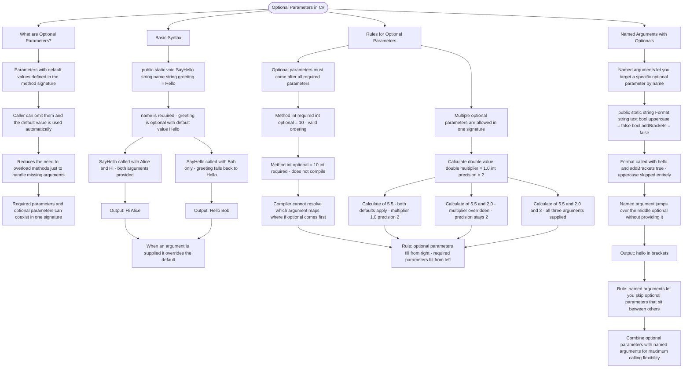

# Optional Parameters

Optional parameters let you define default values for method parameters, making them optional when calling the method.

## Basic Syntax

```cs
// Parameter with default value - must come after required parameters
public static void SayHello(string name, string greeting = "Hello")
{
    Console.WriteLine($"{greeting}, {name}!");
}

// Calling with both arguments
SayHello("Alice", "Hi");  // Output: Hi, Alice!

// Calling with only required argument - uses default
SayHello("Bob");          // Output: Hello, Bob!
```

## Rules for Optional Parameters

```cs
// ✓ Optional parameters must come AFTER required ones
public static void Method(int required, int optional = 10) { }

// ✗ This would NOT compile - optional before required
// public static void Method(int optional = 10, int required) { }

// Multiple optional parameters are allowed
public static double Calculate(double value, double multiplier = 1.0, int precision = 2)
{
    return Math.Round(value * multiplier, precision);
}

Calculate(5.5);              // Uses defaults: multiplier=1.0, precision=2
Calculate(5.5, 2.0);         // Uses multiplier=2
Calculate(5.5, 2.0, 3);      // All arguments provided
```

## Named Arguments with Optionals

```cs
public static string Format(string text, bool uppercase = false, bool addBrackets = false)
{
    var result = uppercase ? text.ToUpper() : text;
    return addBrackets ? $"[{result}]" : result;
}

// Skip middle optional parameter using named argument
Format("hello", addBrackets: true);  // Returns: [hello]
```

# Visualization



The flowchart branches into four sections. **What are Optional Parameters?** establishes the concept — default values baked into the signature so the caller can omit them — and shows how they reduce the need for multiple overloads. **Basic Syntax** traces the SayHello method through both calling styles, converging on the rule that a supplied argument always overrides the default. **Rules for Optional Parameters** maps the valid and invalid orderings and walks through all three ways to call the Calculate method, converging on the principle that optional parameters fill from right to left while required parameters must always be satisfied. **Named Arguments with Optionals** shows how naming an argument at the call site lets you jump over an intermediate optional entirely, converging on the guideline that named arguments and optional parameters together give the caller maximum flexibility over which defaults to keep and which to override.
