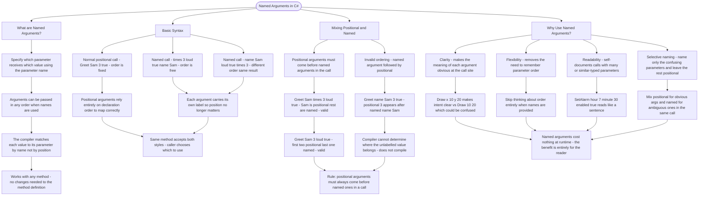

# Named Arguments

Named arguments let you specify which parameter receives which value by using the parameter name, allowing you to pass arguments in any order.

## Basic Syntax

```cs
// Method definition
void Greet(string name, int times, bool loud)
{
    // implementation
}

// Normal positional call - order matters
Greet("Sam", 3, true);

// Named arguments - order doesn't matter!
Greet(times: 3, loud: true, name: "Sam");
Greet(name: "Sam", loud: true, times: 3);
```

## Mixing Positional and Named

```cs
// Positional arguments must come BEFORE named ones
Greet("Sam", times: 3, loud: true);  // Valid - "Sam" is positional
Greet("Sam", 3, loud: true);          // Valid - only last is named

// This is INVALID - positional after named
// Greet(name: "Sam", 3, true);  // Won't compile!
```

## Why Use Named Arguments?

| Benefit          | Example                                        |
| ---------------- | ---------------------------------------------- |
| Clarity          | `Draw(x: 10, y: 20)` vs `Draw(10, 20)`         |
| Flexibility      | Skip thinking about parameter order            |
| Readability      | `SetAlarm(hour: 7, minute: 30, enabled: true)` |
| Selective naming | Name only confusing params                     |

# Visualization



The flowchart branches into four sections. **What are Named Arguments?** establishes the core mechanic — the compiler matches by name rather than position — and confirms that no changes to the method definition are needed. **Basic Syntax** maps all three calling styles side by side, converging on the point that the same method accepts both positional and named calls and the caller freely chooses which to use. **Mixing Positional and Named** traces two valid mixed calls against one invalid one, converging on the rule that positional arguments must always precede named ones because the compiler has no way to place an unlabelled value once a named argument has appeared. **Why Use Named Arguments?** maps the four practical benefits — clarity, flexibility, readability, and selective naming — converging on the principle that named arguments are a zero-cost readability tool whose entire value is for the person reading the call site.
