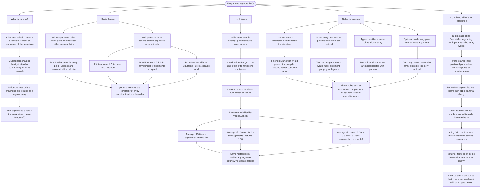

# The params Keyword

The `params` keyword allows a method to accept a variable number of arguments of the same type. Instead of creating an array manually, callers can pass any number of arguments directly.

## Basic Syntax

```cs
// Without params - caller must create an array
public static void PrintNumbers(int[] numbers) { }
PrintNumbers(new int[] { 1, 2, 3 }); // awkward

// With params - caller passes values directly
public static void PrintNumbers(params int[] numbers) { }
PrintNumbers(1, 2, 3);        // clean!
PrintNumbers(1, 2, 3, 4, 5);  // any number of args
PrintNumbers();               // zero args also works
```

## How It Works

```cs
public static double Average(params double[] values)
{
    if (values.Length == 0) return 0;

    double sum = 0;
    foreach (double value in values)
    {
        sum += value;
    }
    return sum / values.Length;
}

// All these calls are valid:
Average(5.0);                    // 1 argument
Average(10.0, 20.0);             // 2 arguments
Average(1.5, 2.5, 3.5, 4.5);     // 4 arguments
```

## Rules for params

| Rule     | Description                                        |
| -------- | -------------------------------------------------- |
| Position | Must be the last parameter in the method signature |
| Count    | Only one `params` parameter allowed per method     |
| Type     | Must be a single-dimensional array                 |
| Optional | Callers can pass zero or more arguments            |

## Combining with Other Parameters

```cs
public static string FormatMessage(string prefix, params string[] words)
{
    return prefix + ": " + string.Join(", ", words);
}

FormatMessage("Items", "apple", "banana", "cherry");
// Returns: "Items: apple, banana, cherry"
```

# Visualization



The flowchart branches into five sections. **What is params?** establishes the core promise — any number of same-type arguments, treated as an array inside the method, with zero being a valid count. **Basic Syntax** contrasts the without-params and with-params calling styles, converging on the principle that params removes all array construction ceremony from the caller. **How It Works** walks through the Average method step by step across three different argument counts, converging on the point that the same method body handles every case without modification. **Rules for params** maps the four constraints — position, count, type, and optionality — converging on the explanation that all four rules exist so the compiler can always resolve calls without ambiguity. **Combining with Other Parameters** traces FormatMessage from definition through to output, converging on the reminder that params must remain last in the signature even when paired with required positional parameters.
