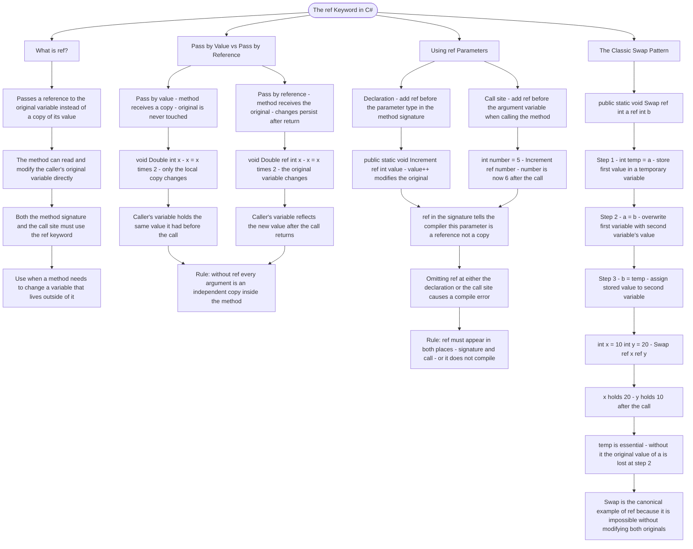

# The ref Keyword

The `ref` keyword allows you to pass arguments **by reference**, meaning the method can modify the original variable, not just a copy of its value.

## Pass by Value vs Pass by Reference

```cs
// Without ref - value is copied, original unchanged
void Double(int x) { x = x * 2; }  // Original NOT modified

// With ref - reference to original variable
void Double(ref int x) { x = x * 2; }  // Original IS modified
```

## Using ref Parameters

```cs
// Declaration: use ref in the parameter
public static void Increment(ref int value)
{
    value++;  // Modifies the original variable
}

// Call: must also use ref keyword
int number = 5;
Increment(ref number);  // number is now 6
```

## The Classic Swap Pattern

```cs
public static void Swap(ref int a, ref int b)
{
    int temp = a;  // Store first value
    a = b;         // Overwrite first with second
    b = temp;      // Set second to stored value
}

int x = 10, y = 20;
Swap(ref x, ref y);  // x=20, y=10
```

## Helper Files Available

- `ResultFormatter.Format(a, b)` - Returns a formatted string like `"a=5, b=10"`
- `SwapHelper.DemoSwap(ref x, ref y)` - A reference implementation of swap

# Visualization



The flowchart branches into four sections. **What is ref?** establishes the core mechanic — a reference to the original variable rather than a copy — and surfaces the rule that both declaration and call site must carry the keyword. **Pass by Value vs Pass by Reference** runs the same Double method in both modes side by side, converging on the principle that without ref every argument inside a method is an independent copy that cannot affect the caller. **Using ref Parameters** traces the Increment example through declaration and call, converging on the compile-time rule that ref must appear in both places or the code will not build. **The Classic Swap Pattern** walks through all three steps of the swap algorithm in order, converging on the explanation that temp is non-negotiable and that swap is the definitive ref example because the operation is structurally impossible without direct access to both original variables.
