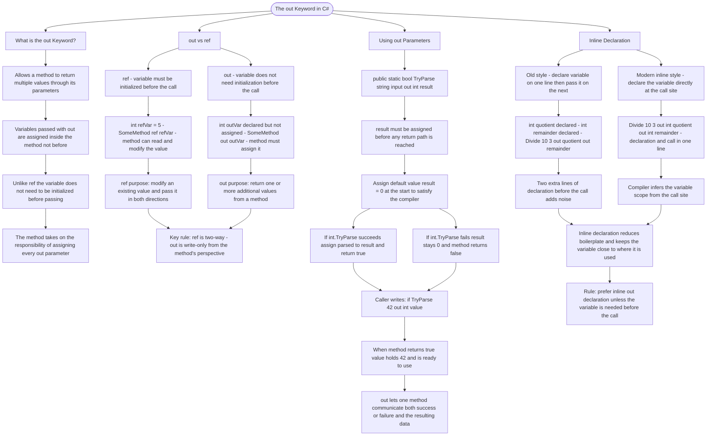

# The out Keyword

The `out` keyword allows a method to return multiple values by passing variables that the method will assign. Unlike `ref`, `out` parameters don't need to be initialized before passing.

## out vs ref

```cs
// ref: variable MUST be initialized before passing
int refVar = 5;
SomeMethod(ref refVar);  // Can read and modify refVar

// out: variable does NOT need initialization
int outVar;
SomeMethod(out outVar);  // Method MUST assign outVar
```

## Key Differences

| Feature                     | ref                   | out                      |
| --------------------------- | --------------------- | ------------------------ |
| Must initialize before call | Yes                   | No                       |
| Method must assign value    | No                    | Yes                      |
| Can read incoming value     | Yes                   | No (undefined)           |
| Purpose                     | Modify existing value | Return additional values |

## Using out Parameters

```cs
// Method with out parameters
public static bool TryParse(string input, out int result)
{
    // out parameter MUST be assigned before returning
    result = 0;  // Assign default

    if (int.TryParse(input, out int parsed))
    {
        result = parsed;
        return true;
    }
    return false;
}

// Calling the method
if (TryParse("42", out int value))
{
    Console.WriteLine(value);  // 42
}
```

## Inline Declaration

C# allows declaring `out` variables inline when calling a method:

```cs
// Old style
int quotient;
int remainder;
Divide(10, 3, out quotient, out remainder);

// Modern inline style
Divide(10, 3, out int quotient, out int remainder);
```

# Visualization



The flowchart branches into four sections. **What is the out Keyword?** establishes the core contract — the caller supplies an uninitialized variable and the method takes on the obligation of assigning it before returning. **out vs ref** contrasts the two keywords across initialization requirements, assignment obligations, and read access, converging on the rule that ref is two-way while out is write-only from the method's perspective. **Using out Parameters** walks through the TryParse implementation step by step, tracing both the success and failure paths and converging on the insight that out lets a single method communicate both an outcome and the resulting data simultaneously. **Inline Declaration** contrasts the old two-step style against the modern single-line form, converging on the guideline that inline declaration should be preferred whenever the variable is not needed before the call.
