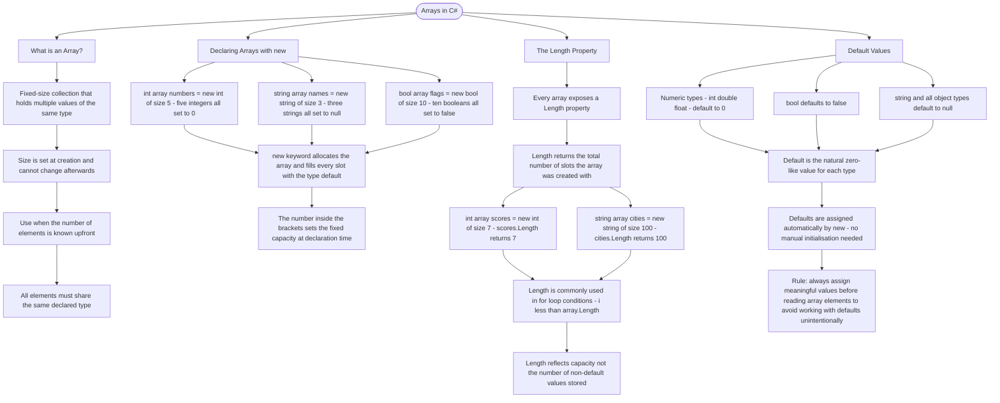

# Arrays in C#

An array is a fixed-size collection that holds multiple values of the same type. Use arrays when you know exactly how many elements you need upfront.

## Declaring Arrays with `new`

```cs
// Create an array with a specific size (all elements initialized to default values)
int[] numbers = new int[5];        // 5 integers, all initialized to 0
string[] names = new string[3];    // 3 strings, all initialized to null
bool[] flags = new bool[10];       // 10 booleans, all initialized to false
```

## The Length Property

Every array has a `Length` property that tells you how many elements it can hold:

```cs
int[] scores = new int[7];
Console.WriteLine(scores.Length);  // Prints: 7

string[] cities = new string[100];
int size = cities.Length;          // size is 100
```

## Default Values

When you create an array with `new`, all elements are set to their default values:

| Type               | Default Value |
| ------------------ | ------------- |
| int, double, float | 0             |
| bool               | false         |
| string, objects    | null          |

# Visualization



The flowchart branches into four sections. **What is an Array?** establishes the two defining constraints — fixed size and single type — and anchors the guidance that arrays suit scenarios where the element count is known upfront. **Declaring Arrays with new** maps the three common type examples, converging on the principle that the `new` keyword both allocates the array and fills every slot with the type's default value. **The Length Property** traces two concrete examples and converges on the important distinction that `Length` reflects the declared capacity, not the count of meaningful values stored. **Default Values** maps the three default categories by type, converges on the rule that defaults are assigned automatically, and closes with the practical warning to assign real values before reading slots to avoid silently operating on defaults.
