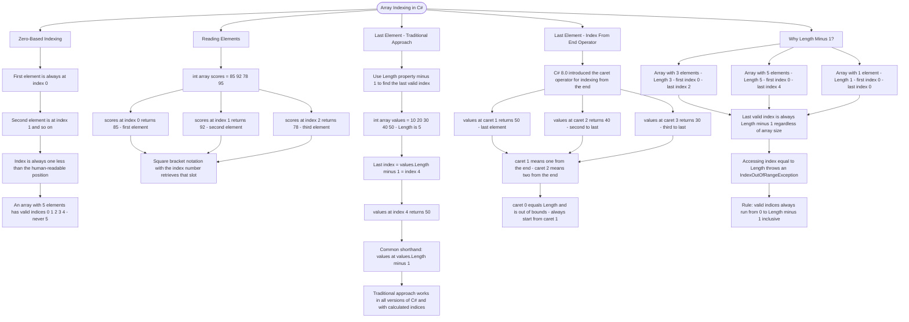

# Array Indexing

Arrays use zero-based indexing to access elements. The first element is at index 0, the second at index 1, and so on.

## Reading Elements

```cs
int[] scores = { 85, 92, 78, 95 };

int first = scores[0];   // 85 (first element)
int second = scores[1];  // 92 (second element)
int third = scores[2];   // 78 (third element)
```

## Finding the Last Element - Traditional Approach

To access the last element, use the array's `Length` property minus one:

```cs
int[] values = { 10, 20, 30, 40, 50 };

int length = values.Length;       // 5 elements
int lastIndex = values.Length - 1; // Index 4
int lastValue = values[lastIndex]; // 50

// Common shorthand:
int last = values[values.Length - 1]; // 50
```

## Finding the Last Element - Index From End (^) Operator

C# 8.0+ introduced the `^` (index from end) operator for cleaner syntax:

```cs
int[] values = { 10, 20, 30, 40, 50 };

int last = values[^1];        // 50 (last element)
int secondLast = values[^2];  // 40 (second to last)
int thirdLast = values[^3];   // 30 (third to last)
```

The `^1` means "1 from the end", `^2` means "2 from the end", and so on. Note that `^0` would be out of bounds (it equals `Length`).

## Comparing Both Approaches

| Task           | Traditional           | Index From End |
| -------------- | --------------------- | -------------- |
| Last element   | `arr[arr.Length - 1]` | `arr[^1]`      |
| Second to last | `arr[arr.Length - 2]` | `arr[^2]`      |
| Third to last  | `arr[arr.Length - 3]` | `arr[^3]`      |

Both approaches are valid. The `^` operator is more concise, while the traditional approach works in all C# versions and is sometimes necessary when working with calculated indices.

## Why Length - 1?

Since indexing starts at 0, an array with 5 elements has indices 0, 1, 2, 3, 4. The last valid index is always `Length - 1`.

| Array             | Length | First Index | Last Index |
| ----------------- | ------ | ----------- | ---------- |
| `{5, 10, 15}`     | 3      | 0           | 2          |
| `{1, 2, 3, 4, 5}` | 5      | 0           | 4          |
| `{100}`           | 1      | 0           | 0          |

# Visualization



The flowchart branches into five sections. **Zero-Based Indexing** establishes the foundational rule that every index is one less than its human-readable position, and that a five-element array never has an index of 5. **Reading Elements** maps the scores array showing how each index retrieves a specific slot, converging on the pattern that square bracket notation is the universal access mechanism. **Last Element - Traditional Approach** traces the Length-minus-1 calculation step by step, converging on the shorthand form and the note that this approach works across all C# versions. **Last Element - Index From End Operator** maps the caret operator for the last three positions, converging on the out-of-bounds warning that caret 0 equals Length and is always invalid. **Why Length Minus 1?** grounds the rule in three concrete arrays of different sizes, converging on the exception that fires when the boundary is crossed and closing with the definitive rule that valid indices always span 0 to Length minus 1 inclusive.
