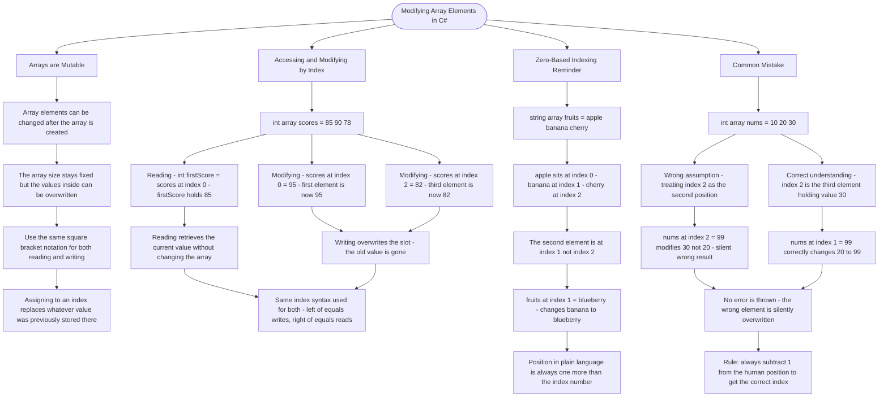

# Modifying Array Elements

Arrays are mutable, meaning you can change their elements after creation. You access and modify elements using their index position.

## Accessing Elements by Index

```cs
int[] scores = { 85, 90, 78 };

// Reading an element
int firstScore = scores[0];  // 85

// Modifying an element
scores[0] = 95;  // First element is now 95
scores[2] = 82;  // Third element is now 82
```

## Remember: Zero-Based Indexing

```cs
string[] fruits = { "apple", "banana", "cherry" };
//                    [0]       [1]        [2]

// The "second" element is at index 1
fruits[1] = "blueberry";  // Changes "banana" to "blueberry"
```

## Common Mistake

```cs
int[] nums = { 10, 20, 30 };

// WRONG: Trying to access the "second" position with index 2
// nums[2] is actually the THIRD element (value 30)

// CORRECT: The second element is at index 1
nums[1] = 99;  // Changes 20 to 99
```

# Visualization



The flowchart branches into four sections. **Arrays are Mutable** establishes that while the size is fixed the values are not, and that the same square bracket notation covers both reading and writing. **Accessing and Modifying by Index** traces the scores array through one read and two writes, converging on the rule that the position of an expression relative to the equals sign determines whether it reads or overwrites. **Zero-Based Indexing Reminder** maps each fruit to its index and traces the blueberry assignment, converging on the off-by-one principle that a plain-language position is always one greater than its index. **Common Mistake** runs the wrong and correct assumptions side by side against the same array, converging on the warning that accessing the wrong index produces no error and silently overwrites the unintended element, closing with the rule to always subtract 1 from the human position to land on the correct index.
