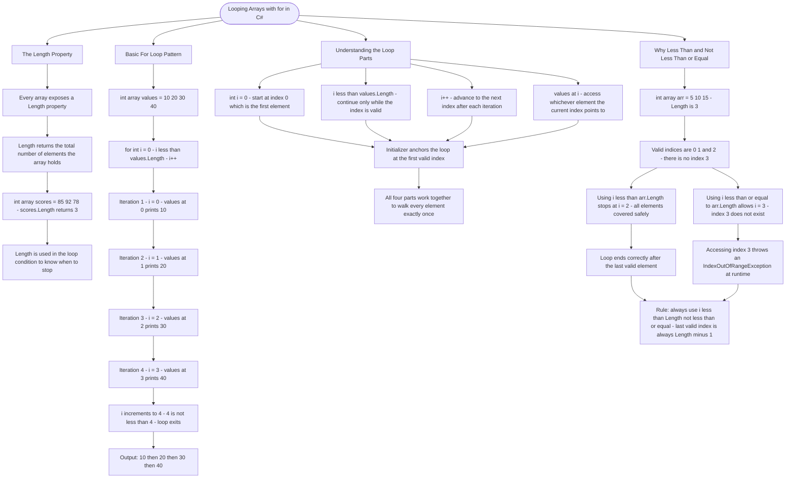

# Looping Arrays with for

The `for` loop is the classic way to iterate through arrays when you need access to the index. It gives you precise control over which elements to access and in what order.

## The Length Property

Every array has a `Length` property that tells you how many elements it contains:

```cs
int[] scores = { 85, 92, 78 };
Console.WriteLine(scores.Length); // Output: 3
```

## Basic For Loop Pattern

The standard pattern for iterating through an entire array:

```cs
int[] values = { 10, 20, 30, 40 };

for (int i = 0; i < values.Length; i++)
{
    Console.WriteLine(values[i]);
}
// Output:
// 10
// 20
// 30
// 40
```

## Understanding the Loop

| Part                | Meaning                                 |
| ------------------- | --------------------------------------- |
| `int i = 0`         | Start at index 0 (first element)        |
| `i < values.Length` | Continue while index is valid           |
| `i++`               | Move to next index after each iteration |
| `values[i]`         | Access element at current index         |

## Why Use i < Length (Not <=)?

Arrays are zero-indexed, so valid indices are `0` to `Length - 1`:

```cs
int[] arr = { 5, 10, 15 };
// Length is 3
// Valid indices: 0, 1, 2
// Using i <= arr.Length would try to access index 3 (error!)
```

# Visualization



The flowchart branches into four sections. **The Length Property** establishes that every array carries a Length value and that it is what the loop condition relies on to know when to stop. **Basic For Loop Pattern** traces all four iterations of the values array step by step, showing exactly which index is active, which value is printed, and how the loop exits cleanly when i reaches 4. **Understanding the Loop Parts** maps each of the four loop components to its purpose and converges on the principle that all four work together to walk every element exactly once. **Why Less Than and Not Less Than or Equal** contrasts the safe and unsafe conditions against the same array, converging on the exception that fires at runtime when the boundary is crossed and closing with the rule that the last valid index is always Length minus 1.
