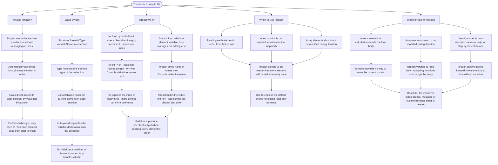

# The foreach Loop

The `foreach` loop provides a simpler way to iterate over collections when you don't need the index. It automatically handles iteration and gives you direct access to each element.

## Basic Syntax

```cs
foreach (Type variableName in collection)
{
    // Use variableName directly
}
```

## foreach vs for

```cs
// Using for - you manage the index
for (int i = 0; i < names.Length; i++)
{
    Console.WriteLine(names[i]);
}

// Using foreach - cleaner when you just need the values
foreach (string name in names)
{
    Console.WriteLine(name);
}
```

## When to Use foreach

- When you need to read each element in order
- When you don't need to know the index
- When you don't need to modify the array during iteration

## When to Use for Instead

- When you need the index for calculations
- When you need to modify array elements
- When you need to iterate in reverse or skip elements

# Visualization



The flowchart branches into five sections. **What is foreach?** establishes the core promise — automatic advancement through every element with no index to manage — and positions it as the default for read-only traversal. **Basic Syntax** breaks down each part of the foreach header, converging on the point that the loop handles all iteration mechanics so there is nothing to initialise, check, or increment manually. **foreach vs for** places both loops side by side against the same array, converging on the trade-off that for exposes more control while foreach offers less ceremony for identical output. **When to Use foreach** maps the three conditions that favour it, converging on the guideline that foreach signals to the reader that every element will be visited exactly once. **When to Use for Instead** maps the three conditions where foreach falls short, converging on the rule that for is the right reach whenever index access, element mutation, or a custom traversal order is needed.
