# Algorithm Complexity & Big O Notation

Big O notation describes how an algorithm's runtime grows as input size increases. It's universal language for analyzing and comparing algorithms, helping you predict performance and choose the right approach.

## What Does "O" Mean?

The "O" stands for the "Order of" and represents the **upper bound** of growth. When we say an algorithm is O(n), we mean its runtime grows **at most** proportionally to the input size.

```cs
// The "n" represents the size of your input
int[] array = new int[1000];  // n = 1000
int[] bigArray = new int[1000000];  // n = 1,000,000
```

## O(n) - Linear Time Complexity

An algorithm is **O(n)** when it performs a constant amount of work for each element in the input. If you double the input size, the runtime roughly doubles.

```cs
// O(n) example - visits each element once
for (int i = 0; i < array.Length; i++
{
  sum += array[i];
}
```

**Real-world analogy**: Reading a book is **O(n)** where **n** is the number of pages. A 200-page book takes roughly twice as long to read as a 100-page book.

---

## Common Big O Complexities Compared

| Notation   | Name         | 10 items | 100 items | 1000 items | Example            |
| ---------- | ------------ | -------- | --------- | ---------- | ------------------ |
| O(1)       | Constant     | 1        | 1         | 1          | Array index access |
| O(log n)   | Logarithmic  | 3        | 7         | 10         | Binary search      |
| O(n)       | Linear       | 10       | 100       | 1,000      | Sum all elements   |
| O(n log n) | Linearithmic | 33       | 664       | 9,966      | Efficient sorting  |
| O(n²)      | Quadratic    | 100      | 10,000    | 1,000,000  | Nested loops       |

## Complexity examples

```cs
// O(1) - Constant time
// Doesn't matter if array has 10 or 10 million elements
int first = array[0];
int length = array.Length;

// O(n) - Linear time
// Must touch every element once
int total = 0;
for (int i = 0; i < array.Length; i++)
    total += array[i];

// O(n²) - Quadratic time
// For each element, we look at every other element
for (int i = 0; i < array.Length; i++)
    for (int j = 0; j < array.Length; j++)
        Console.WriteLine($"{array[i]}, {array[j]}");
```

## Why Summing an Array is O(n)

To calculate the sum of all elements, you **must** examine each element at least once. There's no shortcut - you can't know the total without looking at every value.

```cs
int[] numbers = {3, 7, 2, 9, 1};

// Step by step - each element visited exactly once:
// Visit index 0: sum = 0 + 3 = 3
// Visit index 1: sum = 3 + 7 = 10
// Visit index 2: sum = 10 + 2 = 12
// Visit index 3: sum = 12 + 9 = 21
// Visit index 4: sum = 21 + 1 = 22
// Total visits: 5 (same as array length)
```

| Array Size | Elements Visited | Time (relative) |
| ---------- | ---------------- | --------------- |
| 5          | 5                | 1x              |
| 50         | 50               | 10x             |
| 500        | 500              | 100x            |
| 5,000,000  | 5,000,000        | 1,000,000x      |

The relationship is **Linear** - operations grow proportionally with input size.

## Why O(n) Matters

O(n) is often the **best possible** complexity for problems where you must examine all data. You can't sum an array faster than O(n) because skipping any element means potentially wrong answer.

```cs
// These are ALL O(n) - one pass through data
int max = FindMax(array);      // Must check all to find largest
int min = FindMin(array);      // Must check all to find smallest
int total = CalculateTotal(array);  // Must add all values
bool found = Contains(array, target);  // Worst case: check all
```

## Visualization

```mermaid
flowchart TD
    A([Big O Notation]) --> B[What is Big O?]
    A --> C[Complexities]
    A --> D[O-n Deep Dive]
    A --> E[Why It Matters]

    B --> B1[Order of growth]
    B --> B2[Upper bound of runtime]
    B --> B3[Compares algorithms]
    B --> B4[Predicts performance]

    C --> C1[O-1 Constant]
    C --> C2[O-log n Logarithmic]
    C --> C3[O-n Linear]
    C --> C4[O-n log n Linearithmic]
    C --> C5[O-n2 Quadratic]

    C1 --> C1a[Always 1 operation]
    C1 --> C1b[Example: Array index access]

    C2 --> C2a[Halves problem each step]
    C2 --> C2b[Example: Binary Search]
    C2 --> C2c[10 items to 3 steps]

    C3 --> C3a[One pass per element]
    C3 --> C3b[Example: Sum all elements]
    C3 --> C3c[Double input = Double time]

    C4 --> C4a[Divide and conquer]
    C4 --> C4b[Example: Efficient sorting]
    C4 --> C4c[1000 items to 9966 ops]

    C5 --> C5a[Nested loops]
    C5 --> C5b[Every element vs every element]
    C5 --> C5c[1000 items to 1000000 ops]

    D --> D1[Must visit every element]
    D --> D2[No shortcuts exist]
    D --> D3[Array size 5 to 5 visits]
    D --> D4[Array size 5M to 5M visits]
    D --> D5[Growth is proportional]

    E --> E1[Choose right algorithm]
    E --> E2[Predict performance at scale]
    E --> E3[O-n often best possible]

    E3 --> E3a[FindMax]
    E3 --> E3b[FindMin]
    E3 --> E3c[CalculateTotal]
    E3 --> E3d[Contains]
```


