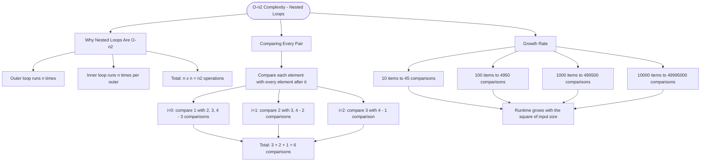

# O(n²) Complexity - Nested Loops

When you have a loop inside another loop, and both iterate over the input, the time complexity becomes **O(n²)** - quadratic time. The runtime grows with the square of the input size.

## Why Nested Loops Are O(n²)

```cs
for (int i = 0; i < n; i++)        // Runs n times
{
    for (int j = 0; j < n; j++)    // For each i, runs n times
    {
        // Total: n × n = n² operations
    }
}
```

## Comparing Every Pair

To check if an array has duplicates using nested loops, we compare each element with every element that comes after it:

```cs
// For array [1, 2, 3, 4]
// i=0: compare 1 with 2, 3, 4  (3 comparisons)
// i=1: compare 2 with 3, 4     (2 comparisons)
// i=2: compare 3 with 4        (1 comparison)
// Total: 3 + 2 + 1 = 6 comparisons
```

## Growth Rate Example

| Array Size | Comparisons (worst case) |
| ---------- | ------------------------ |
| 10         | 45                       |
| 100        | 4,950                    |
| 1,000      | 499,500                  |
| 10,000     | 49,995,000               |

## Visualization


