# Algorithm Complexity Classification

Understanding time complexity helps you predict how an algorithm's performance scales with input size. Each complexity class has distinct characteristics.

## The Five Major Complexity Classes

| Complexity | Name         | What It Means             | Growth Rate      |
| ---------- | ------------ | ------------------------- | ---------------- |
| O(1)       | Constant     | Always same time          | Flat line        |
| O(log n)   | Logarithmic  | Halves problem each step  | Very slow growth |
| O(n)       | Linear       | Touches each element once | Straight line    |
| O(n log n) | Linearithmic | Divide and conquer        | Slightly curved  |
| O(n²)      | Quadratic    | Nested iteration          | Steep curve      |

## Recognizing Each Pattern

```cs
// O(1) - Constant: Direct access, no iteration
int value = array[5];           // Array index lookup
var item = dictionary["key"];   // Hash table lookup
stack.Push(42);                 // Stack operations

// O(log n) - Logarithmic: Eliminates half the data each step
// Binary search on 1,000,000 items: ~20 comparisons
while (low <= high)
{
    int mid = (low + high) / 2;
    if (arr[mid] == target) return mid;
    else if (arr[mid] < target) low = mid + 1;
    else high = mid - 1;
}

// O(n) - Linear: Single pass through data
for (int i = 0; i < n; i++)     // Visit each element once
    sum += array[i];

// O(n log n) - Linearithmic: Efficient sorting
// Merge sort: divide array, recursively sort, merge results
// n elements, log n levels of recursion

// O(n²) - Quadratic: Nested loops comparing pairs
for (int i = 0; i < n; i++)
    for (int j = 0; j < n; j++)  // Compare every pair
        if (arr[j] > arr[j+1]) Swap(arr, j, j+1);
```

## Real-world Performance (n = 10, 000)

| Complexity | Operations  | Time (1μs/op) |
| ---------- | ----------- | ------------- |
| O(1)       | 1           | 0.001 ms      |
| O(log n)   | 13          | 0.013 ms      |
| O(n)       | 10,000      | 10 ms         |
| O(n log n) | 132,877     | 133 ms        |
| O(n²)      | 100,000,000 | 100 sec       |

## Visualization

```mermaid
flowchart TD
    A([Algorithm Complexity Classification]) --> B[Five Major Complexity Classes]
    A --> C[Recognizing Each Pattern]
    A --> D[Real-world Performance at n=10000]

    B --> B1[O-1 Constant]
    B --> B2[O-log n Logarithmic]
    B --> B3[O-n Linear]
    B --> B4[O-n log n Linearithmic]
    B --> B5[O-n2 Quadratic]

    B1 --> B1a[Always same time]
    B1 --> B1b[Flat line growth]
    B2 --> B2a[Halves problem each step]
    B2 --> B2b[Very slow growth]
    B3 --> B3a[Touches each element once]
    B3 --> B3b[Straight line growth]
    B4 --> B4a[Divide and conquer]
    B4 --> B4b[Slightly curved growth]
    B5 --> B5a[Nested iteration]
    B5 --> B5b[Steep curve growth]

    C --> C1[O-1: Direct access, no iteration]
    C --> C2[O-log n: Eliminates half the data each step]
    C --> C3[O-n: Single pass through data]
    C --> C4[O-n log n: Efficient sorting]
    C --> C5[O-n2: Nested loops comparing pairs]

    C1 --> C1a[Array index lookup]
    C1 --> C1b[Hash table lookup]
    C1 --> C1c[Stack operations]
    C2 --> C2a[Binary search]
    C2 --> C2b[1000000 items: ~20 comparisons]
    C3 --> C3a[Visit each element once]
    C3 --> C3b[Example: sum all elements]
    C4 --> C4a[Merge sort]
    C4 --> C4b[n elements, log n levels of recursion]
    C5 --> C5a[Bubble sort]
    C5 --> C5b[Compare and swap every pair]

    D --> D1[O-1: 1 op - 0.001 ms]
    D --> D2[O-log n: 13 ops - 0.013 ms]
    D --> D3[O-n: 10000 ops - 10 ms]
    D --> D4[O-n log n: 132877 ops - 133 ms]
    D --> D5[O-n2: 100000000 ops - 100 sec]

    D1 --> D6[Fastest]
    D2 --> D6
    D3 --> D7[Acceptable]
    D4 --> D7
    D5 --> D8[Potentially unusable at scale]
```


