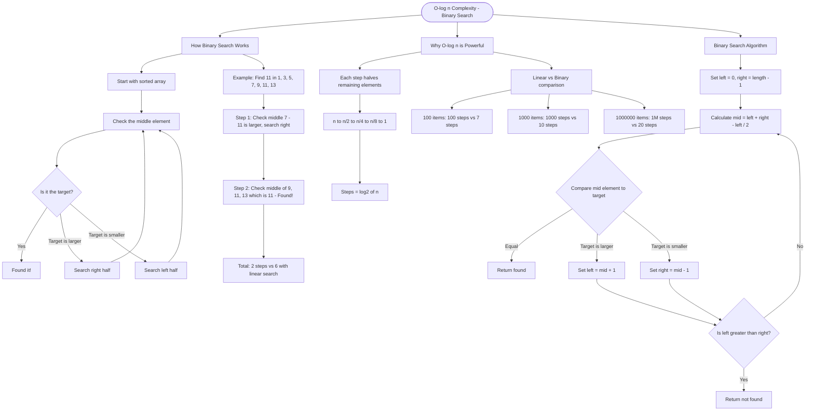

# O(log n) Complexity - Binary Search

Binary search is the classic example of **O(log n)** complexity. Instead of checking every element like linear search O(n), binary search **halves the search space** with each comparison.

## How Binary Search Works

```cs
// On a sorted array [1, 3, 5, 7, 9, 11, 13]
// Searching for 11:

// Step 1: Check middle (7) - 11 > 7, search right half
// Step 2: Check middle of [9, 11, 13] which is 11 - Found!
// Total: 2 steps instead of 6 with linear search
```

## Why O(log n) is Powerful

| Array Size | Linear Search O(n) | Binary Search O(log n) |
| ---------- | ------------------ | ---------------------- |
| 100        | up to 100 steps    | up to 7 steps          |
| 1,000      | up to 1,000 steps  | up to 10 steps         |
| 1,000,000  | up to 1M steps     | up to 20 steps         |

Each step halves the remaining elements: `n → n/2 → n/4 → n/8 → ... → 1`
The number of times you can halve `n` until reaching 1 is **log₂(n)**.

## Binary Search Algorithm

```cs
// 1. Start with left = 0, right = length - 1
// 2. Calculate middle index: mid = left + (right - left) / 2
// 3. Compare middle element to target:
//    - If equal: found it!
//    - If target is larger: search right half (left = mid + 1)
//    - If target is smaller: search left half (right = mid - 1)
// 4. Repeat until left > right (not found)
```

## Visualization


