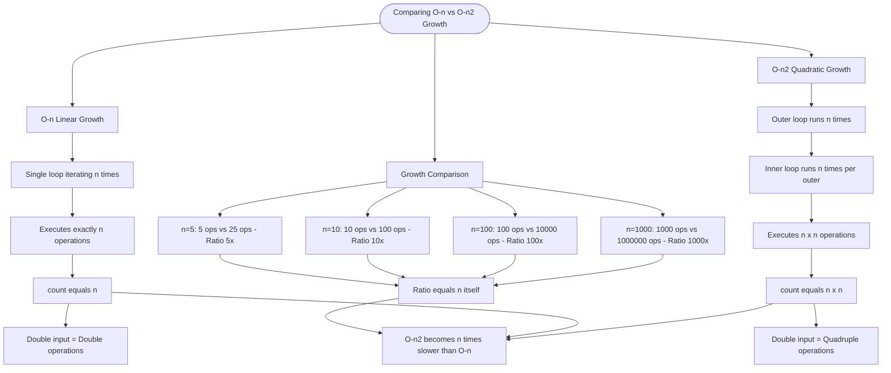

# Comparing O(n) vs O(n²) Growth

The best way to understand algorithm complexity is to see it in action. By counting actual operations, you can observe how dramatically O(n²) algorithms slow down compared to O(n) as input grows.

## O(n) - Linear Growth

```cs
int count = 0;
for (int i = 0; i < n; i++)
{
    count++;  // Executes exactly n times
}
// count == n
```

A single loop iterating `n` times performs exactly `n` operations.

## O(n²) - Quadratic Growth

```cs
int count = 0;
for (int i = 0; i < n; i++)
{
    for (int j = 0; j < n; j++)
    {
        count++;  // Executes n × n times
    }
}
// count == n * n
```

Nested loops where both iterate `n` times perform `n × n = n²` operations.

## Growth Comparison

| n    | O(n) ops | O(n²) ops | Ratio |
| ---- | -------- | --------- | ----- |
| 5    | 5        | 25        | 5×    |
| 10   | 10       | 100       | 10×   |
| 100  | 100      | 10,000    | 100×  |
| 1000 | 1,000    | 1,000,000 | 1000× |

Notice how the ratio equals `n` itself - O(n²) becomes `n` times slower than O(n)!.

## Visualization


