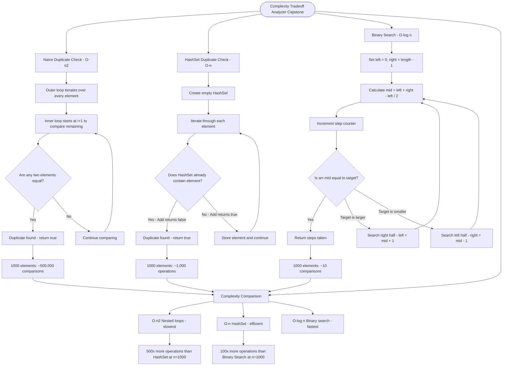

# Complexity Tradeoff Analyzer Capstone

This capstone exercise brings together the key complexity concepts you've learned: **O(n²)** nested loops, **O(n)** HashSet lookups, and **O(log n)** binary search.

## The Three Algorithms

1. **Naive Duplicate Check - O(n²)**

```cs
// Compare every pair of elements
for (int i = 0; i < arr.Length; i++)
    for (int j = i + 1; j < arr.Length; j++)
        if (arr[i] == arr[j]) return true;
```

2. **HashSet Duplicate Check - O(n)**

```cs
// Track seen values with O(1) lookups
HashSet<int> seen = new HashSet<int>();
foreach (int num in arr)
    if (!seen.Add(num)) return true;
```

3. **Binary Search - O(log n)**

```cs
// Each comparison halves the search space
while (left <= right)
{
    steps++;
    int mid = left + (right - left) / 2;
    if (arr[mid] == target) return steps;
    // Narrow to left or right half
}
```

## Complexity Comparison

| Algorithm     | Time Complexity | 1000 elements        |
| ------------- | --------------- | -------------------- |
| Nested loops  | O(n²)           | ~500,000 comparisons |
| HashSet       | O(n)            | ~1,000 operations    |
| Binary search | O(log n)        | ~10 comparisons      |

## Visualization


